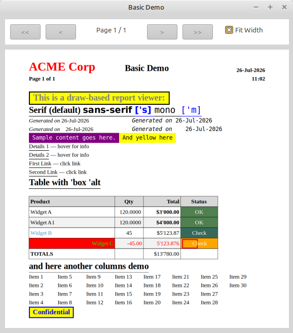

# draw-report.red

A Red module that generates multi-page A4 reports using Red's `draw` dialect with built-in page viewer. No PostScript, no ps2pdf, no external dependencies.



## How it works

The module renders report content into `draw` command blocks (one per page). The `render-page` function renders any page at native resolution. Pages are displayed in a Red-View window with Fit Width mode, mouse wheel scroll, and keyboard navigation.

**Dependencies:** Red with View (`red-view`)

## Usage

```red
do %draw-report.red
```

### Exports

Only two globals are exported:

```red
report-viewer                   ; default viewer instance
make-viewer                     ; create a new independent viewer instance
```

All other functions are methods on a viewer instance:

```red
report-viewer/paper-format 'a4                  ; set paper size (default: a4)
report-viewer/paper-format/landscape 'a4        ; landscape orientation
report-viewer/paper-format 500x800              ; custom size in points (WxH)
report-viewer/fontsize 14                       ; set font size (default: 12)
report-viewer/set-hint-delay 3                  ; hint hover delay in seconds (default: 1)
pages: report-viewer/generate-view content      ; returns block of draw blocks
rendered: report-viewer/render-page page 200    ; render at zoom %
report-viewer/show-viewer/title/on-link/on-hint rendered "Title" :link-fn :hint-fn
```

### Independent viewer instances

Use `make-viewer` to create independent viewer instances for popups or multi-document scenarios. Each instance has its own config (page size, font, margins) that won't interfere with other instances:

```red
; Main report
report-viewer/paper-format 'a4
pages: report-viewer/generate-view main-report

; Popup with different page size — uses its own viewer instance
popup: make-viewer
popup/paper-format 480x400
popup/fontsize 12
popup-pages: popup/generate-view popup-content
```

### Typical usage

```red
pages: report-viewer/generate-view rpt
rendered: copy []
foreach p pages [append/only rendered report-viewer/render-page p 200]
report-viewer/show-viewer/title rendered "My Report"
```

### Interactive links and hints

Add clickable links and hover hints using style words `'link-1`, `'link-2`, ... and `'hint-1`, `'hint-2`, ...:

```red
["Invoice #12345" ['b 'link-1]]         ; clickable link, id=1
["Details" ['u 'hint-2]]                ; hover hint, id=2
["Widget A" ['link-3 'hint-3]]          ; both on same value
```

Links and hints work in tables, content lines, headers, and footers:

```red
['table ["Name" ['< 30] "Price" ['> 10]]
    ["Widget" ['link-1] 100]]
```

Use `/on-link` and/or `/on-hint` refinements to provide handlers:

```red
report-viewer/show-viewer/title/on-link/on-hint rendered "My Report"
    func [id [integer!] text [string!]][      ; called on click
        view [text (rejoin ["Link " id ": " text]) button "OK" [unview]]
    ]
    func [id [integer!] text [string!]][      ; called after hover delay
        print rejoin ["Hint " id ": " text]
    ]
```

- `'link-N` — on click, calls the `/on-link` handler with `(id, text)`
- `'hint-N` — after hovering for `hint-delay` seconds (default 1), calls the `/on-hint` handler with `(id, text)`
- Both can appear on the same element: `['link-1 'hint-2]`
- Handlers are independent — provide one, both, or neither
- In report-generator (PDF output), `'link`/`'hint` styles are silently ignored — the same content DSL works for both viewers

`render-page p 200` renders at 2× resolution (1190×1684 for A4) for sharp text at any zoom. Only one page image is held at a time, so memory stays flat.

## The one rule

Same content DSL as `report-generator`:

```red
[ [styles] value [styles] value value [styles]]
```

All styles work everywhere. See the [report-generator README](../report-generator/README.md) for the complete styles reference.

### Font styles (draw-report specific)

| Style | Font | Notes |
|-------|------|-------|
| (default) | serif | Platform-specific: "Times New Roman" (Windows), "serif" (Linux/Mac) |
| `'s` | sans-serif | e.g. " and sans-serif" `['s]` |
| `'m` | monospace | Platform-specific: "Courier New" (Windows), "monospace" (Linux/Mac) |

Fonts are set via Red's built-in `font-serif`, `font-sans-serif`, and `font-fixed` variables for platform independence.

## Viewer features

The built-in viewer (`show-viewer`) provides:

- **Orientation popup** — choose portrait or landscape before opening
- **Page View** (default) — entire page fits the window, auto-scales on resize
- **Fit Width checkbox** — page width matches window width, scroll to see overflow
- **Mouse wheel** — in Page View: switches pages; in Fit Width: scrolls up/down
- **Keyboard** — Left/Right arrows: switch pages; Up/Down arrows: scroll (Fit Width mode)
- **Navigation buttons** — `<<` `<` `>` `>>` with automatic enable/disable at boundaries
- **Window resize** — page auto-adjusts to fill available space (`react`)

### Key interactions

| Action | Page View mode | Fit Width mode |
|--------|---------------|----------------|
| Mouse wheel up/down | Previous/next page | Scroll up/down |
| Arrow left/right | Previous/next page | Previous/next page |
| Ctrl+Arrow left | First page | First page |
| Ctrl+Arrow right | Last page | Last page |
| Arrow up/down | — | Scroll up/down |
| `<<` button | First page | First page |
| `<` button | Previous page | Previous page |
| `>` button | Next page | Next page |
| `>>` button | Last page | Last page |
| Window resize | Page scales to fit | Page width tracks window |
| Checkbox "Fit Width" | Switch to Fit Width | Switch to Page View |

Buttons are disabled when at the first or last page.

## Examples

- `basic-demo.red` — minimal demo
- `draw-report-test.red` — full test harness with tables, columns, styles

## Differences from report-generator

| | report-generator | draw-report |
|---|---|---|
| Output | PostScript → PDF (via ps2pdf) | draw blocks → images (in-memory) |
| Dependencies | Ghostscript (ps2pdf) | None (pure Red) |
| Viewing | PDF viewer (external) | Red-View with Fit Width + scroll |
| Content DSL | Identical | Identical |
| Font metrics | PostScript `stringwidth` | `size-text/with` |
| Coordinates | PostScript (Y up from bottom) | Draw (Y down from top) |
| Interactive links | No (`'link-N` ignored) | Click handler via `/on-link` |
| Hover hints | No (`'hint-N` ignored) | Hover handler via `/on-hint` (configurable delay) |
| Frame color | Yes (3rd tuple) | Yes (3rd tuple) |

## Architecture

Same `context [...]` structure as report-generator. All parsing, formatting, style, and layout code is identical. The render layer (`draw-styled-text`, `draw-rect`, etc.) emits `draw` block commands instead of PostScript strings.

Font objects are created with set-words and cached by style combination and size. Text measurement uses `size-text/with` on a shared face object. The Y-axis is flipped via `to-draw-y`. Text positioning accounts for draw's top-left anchoring (vs PostScript baseline).

The viewer uses a `panel` face to clip the image during Fit Width scrolling — the image face extends beyond the panel, and `img-f/offset` controls the visible portion. A single scaled image is cached per page+width; scrolling only changes the offset (no new `draw` calls).
